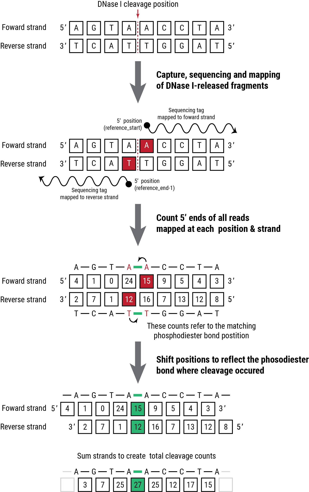

API usage
=========

The ``bamfile`` class
**********************

The ``bamfile`` class converts a sequence alignment file into a count array that represents the cleavages 
in the phosphodiester backbone. Because the coordinates in alignment files represent base-pairs and not phosphate bonds, this class performs
a translation of base-pairs coordinates in the strand specific manner.

Basic usage
^^^^^^^^^^^

.. code:: python

	from footprint_tools.cutcounts import bamfile
	from genome_tools import genomic_interval

	# Open BAM file (requires corresponding index)
	reads = bamfile("experiment.bam", remove=_dups=True)
	
	# Define a region of interest
	region = genomic_interval('chr1', 234567, 234676)

	# Get the base-pair resolved cleavages
	counts = reads[region]

	# Shift and merge + and - strand
	cleavages = counts['+'][1:] + counts['-'][:-1]

Allelically-resolved cleavage counts
^^^^^^^^^^^^^^^^^^^^^^^^^^^^^^^^^^^^

The following code example retrieves reads overlapping a SNV resolved to each allele.

.. code:: python

	import pysam

	vcf_file = pysam.VariantFile("variants.vcf.gz")
	var = vcf_file.fetch(chrom, start, end).next()

	counts = reads[var]

	ref_cleavages = counts[var.ref]['+'][1:] + counts[var.ref]['-'][:-1]
	alt_cleavages = counts[var.alt]['+'][1:] + counts[var.alt]['-'][:-1]

.. autoclass:: footprint_tools.cutcounts.bamfile
       :members:

       .. automethod:: __getitem__

``bias`` module
***************

The ``bias`` module contains classes/methods that apply a sequenced-based model when generating expected cleavage counts. ``bias_model`` is a parent class that contains inherited functions.

.. autoclass:: footprint_tools.modeling.bias.bias_model
	:members:
	:undoc-members:
	:show-inheritance:

``kmer_model`` class
^^^^^^^^^^^^^^^^^^^^

.. autoclass:: footprint_tools.modeling.bias.kmer_model
	:members:
	:undoc-members:
	:show-inheritance:

``uniform_model`` class
^^^^^^^^^^^^^^^^^^^^^^^

.. autoclass:: footprint_tools.modeling.bias.uniform_model
	:members:
	:undoc-members:
	:show-inheritance:

``dispersion`` module
*********************

.. autoclass:: footprint_tools.modeling.dispersion.dispersion_model

.. automethod:: footprint_tools.modeling.dispersion.learn_dispersion_model

.. automethod:: footprint_tools.modeling.dispersion.write_dispersion_model

.. automethod:: footprint_tools.modeling.dispersion.read_dispersion_model

``prediction`` class
********************

.. automodule:: footprint_tools.modeling.predict
	:members:
	:undoc-members:
