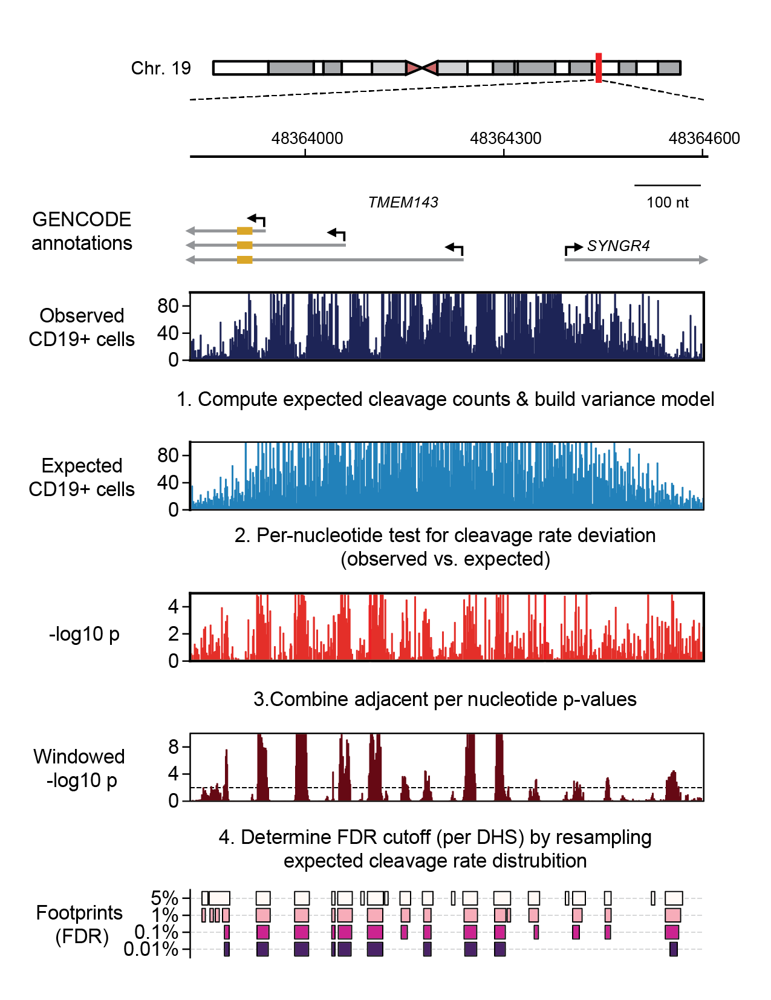
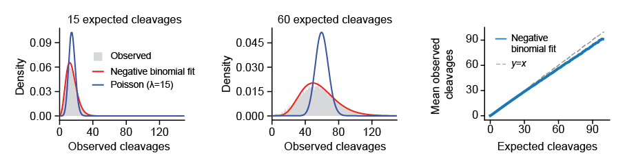

.. |clear|  raw:: html

  

.. _denovo-footprint-detection:

*De novo* footprint detection
-----------------------------

Overview
~~~~~~~~

Footprint-tools implements a footprint detection algorithm that simulates expected cleavage rates using a 6-mer DNase I cleavage preference model combined with density smoothing. Statistical significance of per-nucleotide cleavages are computed from a series emperically fit negative binomial distributions.

  **Example of de novo footprint detection** at the *TMEM143* promoter in CD19+ B cells.

The process of calling footprints involves the following steps: 

1. Computing expected cleavage counts and learning the dispersion (variance) model used to assign statistical significance to the observed per-nucleotide cleavage ratese
2. Statistical testing of observed vs. expected cleavages *per-nucleotide*
3. Combining adjacent *p*-values
4. Adjusting *p*-values for multiple testing by resampling

The above steps are performed by scripts installed as part of the ``footprint-tools`` python package.

Please see `our manuscript <https://doi.org/10.1101/2020.01.31.927798>`_ for further details.

|clear|

.. _expected-cleavages:

Computing expected cleavages
^^^^^^^^^^^^^^^^^^^^^^^^^^^^

We use a hierarchical approach to model the expected cleavages. First, for each base we compute the total cleavages within a small window (typically +/-5nt, total 11nt). We then smooth these values by computing the trimmed mean within a larger window. These values thus reflect both the local density of DNaseI cleavage (in 11 bp windows) and also the shape and magnitude of the entire DHS itself.

.. _dispersion-model:

Building a dispersion model
^^^^^^^^^^^^^^^^^^^^^^^^^^^

Because the vast majority of nucleotides are unoccupied on the genome, we can safely assume that most cleavages represent "background". We take advantage of this to directly estimate the the variance in the observed cleavage counts at expected cleavage rates. To do this, we collect all nucleotides for a given expected cleavage rate (:math:`n=1,2,3,4,..`) and fit a negative binomial to the distribution of observed cleavage counts (rates) at these nucleotides. Testing whether the observed cleavage at an individual nucleotide significantly deviates from expected is straightforward, we just use the negative binomial  distribution for the expected cleavage count (at an idividual nucleotide) and compute the probability of the observed cleavage count (i.e., cumulative lower-tail probability).

  **Example dispersion model.** Left and middle, histogram of observed cleavages counts at nucleotides with 15 (left) and 60 (middle) expected cleavages. Red, maximum likelihood fit of negative binomial distribution. Blue, Poisson distribution with :math:`\lambda` set to 15 or 60. Right, mean of observed cleavages vs. expected cleavages.

Step-by-step guide
~~~~~~~~~~~~~~~~~~~

Step 1: Align sequenced DNase I cleavages
^^^^^^^^^^^^^^^^^^^^^^^^^^^^^^^^^^^^^^^^^

footprint-tools requires an alignment file in BAM format which can be made using any sequence alignment tool. The software uses all reads with a MAPQ > 0. Typically, we also mark tags as QC fail. Inclusion/exclusion of reads by MAPQ and other SAM flags can be specified during execution of the software.

Step 2: Create an index of the reference genome FASTA file
^^^^^^^^^^^^^^^^^^^^^^^^^^^^^^^^^^^^^^^^^^^^^^^^^^^^^^^^^^

The software uses an indexed FASTA file to enable rapid lookups of genomic sequences utilized by the sequence bias model. A FASTA file can be indexed using ``samtools``.

.. code::  bash

    samtools faidx /home/jvierstra/data/genomes/hg19/hg.ribo.all.fa

Step 3: Download or create a 6-mer cleavage bias model
^^^^^^^^^^^^^^^^^^^^^^^^^^^^^^^^^^^^^^^^^^^^^^^^^^^^^^

The sequence bias model is the basis of footprint detection. A model file contains 2 columns that contain a sequence k-mer and a relative preference value. While the bias model can be of any *k*-mer size, we typically use 6mers with the cleavage occurring between the 3rd and 4th base. You can make your own 6mer preference model with :download:`examples/generate_bias_model.sh<../../examples/generate_bias_model.sh>` or use :download:`this pre-computed model <../../data/vierstra_et_al.6mer-model.txt>` (also found in
``data`` folder).

.. literalinclude:: ../../data/vierstra_et_al.6mer-model.txt
  :lines: 1-5,4091-

Step 3a: Create a sequence preference model
^^^^^^^^^^^^^^^^^^^^^^^^^^^^^^^^^^^^^^^^^^^

You can create your own sequence preference model using a provided
template script ``examples/generate_bias_model.sh``. The script counts
the 6mer context of all the cleavage/insertional events such that the 5’
end of the tags is in position 3 (nnn-Nnn; N 5’ end of read oriented for
strand mappped) and then compares it to the prevalence of that 6mer in
the mappable genome. As such, prerequisites for creating a bias model
are: (1) a BAM file from a naked DNaseI experiment, (2) a genome
mappability file corresponding to the read length of the reads in the
BAM file (see below), and (3) an indexed FASTA file for the genome your
BAM file refers to.

.. code:: bash

   [jvierstra@test0 examples]$ ./generate_bias_model.sh --temporary-dir /tmp/jvierstra reads.filtered.bam mappability.stranded.bed  /home/jvierstra/data/genomes/hg19/hg.ribo.all.fa naked.model.txt

The mappability file specifies the regions of the genome where the
sequencing strategy can detect cleavage events. Fortunately, the ENCODE
project (Roderic Guigo’s lab at CRG Barcelona) has created a track that
predicts the alignability of positions by putative read length. The
script above requires a file which contains regions where the 5’
positions are mappable in a stranded fashion. It is simple to convert
the CRG track into a stranded mappability track:

.. code:: bash

   # Creates a stranded mappability file for 36mer read length

   wget http://hgdownload.cse.ucsc.edu/goldenpath/hg38/encodeDCC/wgEncodeMapability/wgEncodeCrgMapabilityAlign36mer.bigWig

   bigWigToBedGraph wgEncodeCrgMapabilityAlign36mer.bigWig /dev/stdout 
   | awk -v OFS="\t" '
           $4 >= 0.5 { print $1, $2, $3, ".", ".", "+"; 
           print $1, $2+36-1, $3+36-1, ".", ".", "-"; }
       '
   | sort-bed --max-mem 16G - 
   > mappability.stranded.bed

Step 4: Create a dispersion (error) model
^^^^^^^^^^^^^^^^^^^^^^^^^^^^^^^^^^^^^^^^^

We use a negative binomial to compute the significance of
per-nucleotide cleavage devations from the expected. The negative
binomial has two parameters, mu and r. The script
``ftd-learn-dispersion-model`` emperically fits :math:`\mu` and :math:`r` from the
observed cleavage data and then interpolates all values using linear
regression. ``ftd-learn-dispersion-model`` writes a dispersion model in
JSON format to standard out which can then be used with all follow-on
analyses.

.. code:: bash

   [jvierstra@test0 footprint-tools]$ ftd-learn-dispersion-model -h
   usage: ftd-learn-dispersion-model [-h] [--bm MODEL_FILE] [--half-win-width N]
                     [--remove-dups] [--bam-offset N]
                     [--processors N]
                     bam_file fasta_file interval_file

   Learn a negative binomial dispersion model from data corrected for sequence
   preference

   positional arguments:
     bam_file            Path to BAM-format tag sequence file
     fasta_file          Path to genome FASTA file (requires associated FASTA
                 index in same folder; see documentation on how to create
                 an index)
     interval_file       File path to BED file

   optional arguments:
     -h, --help          show this help message and exit

   bias modeling options:
     --bm MODEL_FILE     Use a k-mer model for local bias (supplied by file). If
                 argument is not provided the model defaults to uniform
                 sequence bias.
     --half-win-width N  Half window width to apply bias model. (default: 5)

   other options:
     --remove-dups       Remove duplicate reads from analysis (SAM flag -- 1024)
     --bam-offset N      BAM file offset (support for legacy BAM/SAM format)
                 (default: (0, -1))
     --processors N      Number of processors to use. (default: all available
                 processors)

The dispersion model is typically generated from a random subset of the
accessible regions wthin the genome.

Step 4a: Visualize dispersion model
^^^^^^^^^^^^^^^^^^^^^^^^^^^^^^^^^^^

See the :doc:`here <examples/dispersion>` for an example of how to visualize the dispersion model using python and matplotlib

Step 5: Compute per-nucleotide expected cleavages
^^^^^^^^^^^^^^^^^^^^^^^^^^^^^^^^^^^^^^^^^^^^^^^^^

.. code:: bash

   [jvierstra@test0 ~]$ ftd-compute-deviation -h
   usage: ftd-compute-deviation [-h] [--bm MODEL_FILE] [--half-win-width N]
                    [--smooth-half-win-width N] [--smooth-clip N]
                    [--dm MODEL_FILE] [--fdr-shuffle-n N]
                    [--remove-dups] [--bam-offset N] [--processors N]
                    bam_file fasta_file interval_file

   Compute the per-nucleotide cleavage deviation statistics

   positional arguments:
     bam_file              Path to BAM-format tag sequence file
     fasta_file            Path to genome FASTA file (requires associated FASTA
               index in same folder; see documentation on how to
               create an index)
     interval_file         File path to BED file

   optional arguments:
     -h, --help            show this help message and exit

   bias modeling options:
     --bm MODEL_FILE       Use a k-mer model for local bias (supplied by file).
               If argument is not provided the model defaults to
               uniform sequence bias.
     --half-win-width N    Half window width to apply bias model. (default: 5)

   smoothing options:
     --smooth-half-win-width N
               Half window width to apply smoothing model. When set
               to zero no smoothing is applied. (default: 50)
     --smooth-clip N       Fraction of signal to clip when computing trimmed
               mean. (default: 0.01)

   statistics options:
     --dm MODEL_FILE       Dispersion model for negative binomial tests. If
               argument is not provided then no stastical output is
               provided. File is in JSON format and generated using
               the 'ftd-learn-dispersion-model' script included in
               the software package.
     --fdr-shuffle-n N     Number of times to shuffle data for FDR calculation.
               (default: 50)

   other options:
     --remove-dups         Remove duplicate reads from analysis (SAM flag --
               1024)
     --bam-offset N        BAM file offset (support for legacy BAM/SAM format)
               (default: (0, -1))
     --processors N        Number of processors to use. (default: all available
               processors)

The ``ftd-compute-deviation`` script writes to standard out. 

**Ouptput file format:**

=== ============ ===========
#   Column       Description
=== ============ ===========
1   ``contig``   Chromosome
2   ``start``    Position (0-based)
3   ``end``      Position+1
4   ``expected`` Expected cleavages
5   ``observed`` Observed cleavages
6   ``lnp``      –log *p*-value of the deviation from expected
7   ``winlp``    –log combined *p*-value (Stouffer's Z-score)
8   ``fpr``      Corrected p-value (emperical FPR)
=== ============ ===========

**Example output:**

::

   [jvierstra@test0 ~]$ ftd-compute-deviation --bm vierstra_et_al.txt --dm model.json
       reads.bam genome.fa dhs.bed > per-nucleotide.bedgraph
   [jvierstra@test0 footprint-tools]$ head per-nucleotide.bedgraph
   chr1    39585441        39585442        0       0       0.1719  0.0017  1.1579
   chr1    39585442        39585443        0       0       0.1719  0.0017  1.1579
   chr1    39585443        39585444        0       0       0.1719  0.0017  1.1579
   chr1    39585444        39585445        0       0       0.1719  0.0017  1.1579
   chr1    39585445        39585446        0       0       0.1719  0.0017  1.1579
   ...

Step 6: Retrieving footprints
^^^^^^^^^^^^^^^^^^^^^^^^^^^^^

Footprints can be retrieved by thresholding on either p-values or the
emperical FDR and then merging consecutive bases.

.. code:: bash

   cat per-nucleotide.bedgraph \
       | awk -v OFS="\t" -v thresh=0.01 '$8 <= thresh { print $1, $2-3, $3+3; }' \
       | sort-bed --max-mem 8G - \
       | bedops -m - \
   > ${output_dir}/interval.all.fps.\${thresh}.bed

Appendix: SLURM parallelization
^^^^^^^^^^^^^^^^^^^^^^^^^^^^^^^

See :download:`this script <../../examples/compute_deviation.slurm>` for an example of how to
parallelize footprint discovery on the a SLURM enabled cluster.